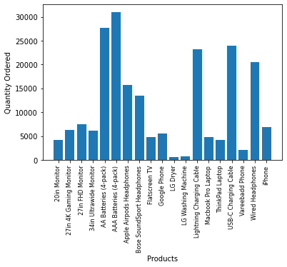

## Departmental Store Sales Analysis


```python
import pandas as pd
import os
```


```python
df = pd.read_csv(r"C:/Users/DELL/Ayush Practise/Sales_January_2019.csv")
df
```


<div>
<style scoped>
    .dataframe tbody tr th:only-of-type {
        vertical-align: middle;
    }

    .dataframe tbody tr th {
        vertical-align: top;
    }

    .dataframe thead th {
        text-align: right;
    }
</style>
<table border="1" class="dataframe">
  <thead>
    <tr style="text-align: right;">
      <th></th>
      <th>Order ID</th>
      <th>Product</th>
      <th>Quantity Ordered</th>
      <th>Price Each</th>
      <th>Order Date</th>
      <th>Purchase Address</th>
    </tr>
  </thead>
  <tbody>
    <tr>
      <th>0</th>
      <td>141234</td>
      <td>iPhone</td>
      <td>1</td>
      <td>700</td>
      <td>01/22/19 21:25</td>
      <td>944 Walnut St, Boston, MA 02215</td>
    </tr>
    <tr>
      <th>1</th>
      <td>141235</td>
      <td>Lightning Charging Cable</td>
      <td>1</td>
      <td>14.95</td>
      <td>01/28/19 14:15</td>
      <td>185 Maple St, Portland, OR 97035</td>
    </tr>
    <tr>
      <th>2</th>
      <td>141236</td>
      <td>Wired Headphones</td>
      <td>2</td>
      <td>11.99</td>
      <td>01/17/19 13:33</td>
      <td>538 Adams St, San Francisco, CA 94016</td>
    </tr>
    <tr>
      <th>3</th>
      <td>141237</td>
      <td>27in FHD Monitor</td>
      <td>1</td>
      <td>149.99</td>
      <td>01/05/19 20:33</td>
      <td>738 10th St, Los Angeles, CA 90001</td>
    </tr>
    <tr>
      <th>4</th>
      <td>141238</td>
      <td>Wired Headphones</td>
      <td>1</td>
      <td>11.99</td>
      <td>01/25/19 11:59</td>
      <td>387 10th St, Austin, TX 73301</td>
    </tr>
    <tr>
      <th>...</th>
      <td>...</td>
      <td>...</td>
      <td>...</td>
      <td>...</td>
      <td>...</td>
      <td>...</td>
    </tr>
    <tr>
      <th>9718</th>
      <td>150497</td>
      <td>20in Monitor</td>
      <td>1</td>
      <td>109.99</td>
      <td>01/26/19 19:09</td>
      <td>95 8th St, Dallas, TX 75001</td>
    </tr>
    <tr>
      <th>9719</th>
      <td>150498</td>
      <td>27in FHD Monitor</td>
      <td>1</td>
      <td>149.99</td>
      <td>01/10/19 22:58</td>
      <td>403 7th St, San Francisco, CA 94016</td>
    </tr>
    <tr>
      <th>9720</th>
      <td>150499</td>
      <td>ThinkPad Laptop</td>
      <td>1</td>
      <td>999.99</td>
      <td>01/21/19 14:31</td>
      <td>214 Main St, Portland, OR 97035</td>
    </tr>
    <tr>
      <th>9721</th>
      <td>150500</td>
      <td>AAA Batteries (4-pack)</td>
      <td>2</td>
      <td>2.99</td>
      <td>01/15/19 14:21</td>
      <td>810 2nd St, Los Angeles, CA 90001</td>
    </tr>
    <tr>
      <th>9722</th>
      <td>150501</td>
      <td>Google Phone</td>
      <td>1</td>
      <td>600</td>
      <td>01/13/19 16:43</td>
      <td>428 Cedar St, Boston, MA 02215</td>
    </tr>
  </tbody>
</table>
<p>9723 rows × 6 columns</p>
</div>


### Importing all files from a directory at once


```python
files = [file for file in os.listdir('./Ayush Practise')]
for file in files:
    print(file)
```

    Sales_April_2019.csv
    Sales_August_2019.csv
    Sales_December_2019.csv
    Sales_February_2019.csv
    Sales_January_2019.csv
    Sales_July_2019.csv
    Sales_June_2019.csv
    Sales_March_2019.csv
    Sales_May_2019.csv
    Sales_November_2019.csv
    Sales_October_2019.csv
    Sales_September_2019.csv
    

### Task 1) Concatenate 12 months of data into single data frame.


```python
comb_df = pd.DataFrame()
```


```python
for file in files:
    df = pd.read_csv("./Ayush Practise/"+file)
    comb_df = pd.concat([comb_df,df])
    
comb_df
```


<div>
<style scoped>
    .dataframe tbody tr th:only-of-type {
        vertical-align: middle;
    }

    .dataframe tbody tr th {
        vertical-align: top;
    }

    .dataframe thead th {
        text-align: right;
    }
</style>
<table border="1" class="dataframe">
  <thead>
    <tr style="text-align: right;">
      <th></th>
      <th>Order ID</th>
      <th>Product</th>
      <th>Quantity Ordered</th>
      <th>Price Each</th>
      <th>Order Date</th>
      <th>Purchase Address</th>
    </tr>
  </thead>
  <tbody>
    <tr>
      <th>0</th>
      <td>176558</td>
      <td>USB-C Charging Cable</td>
      <td>2</td>
      <td>11.95</td>
      <td>04/19/19 08:46</td>
      <td>917 1st St, Dallas, TX 75001</td>
    </tr>
    <tr>
      <th>1</th>
      <td>NaN</td>
      <td>NaN</td>
      <td>NaN</td>
      <td>NaN</td>
      <td>NaN</td>
      <td>NaN</td>
    </tr>
    <tr>
      <th>2</th>
      <td>176559</td>
      <td>Bose SoundSport Headphones</td>
      <td>1</td>
      <td>99.99</td>
      <td>04/07/19 22:30</td>
      <td>682 Chestnut St, Boston, MA 02215</td>
    </tr>
    <tr>
      <th>3</th>
      <td>176560</td>
      <td>Google Phone</td>
      <td>1</td>
      <td>600</td>
      <td>04/12/19 14:38</td>
      <td>669 Spruce St, Los Angeles, CA 90001</td>
    </tr>
    <tr>
      <th>4</th>
      <td>176560</td>
      <td>Wired Headphones</td>
      <td>1</td>
      <td>11.99</td>
      <td>04/12/19 14:38</td>
      <td>669 Spruce St, Los Angeles, CA 90001</td>
    </tr>
    <tr>
      <th>...</th>
      <td>...</td>
      <td>...</td>
      <td>...</td>
      <td>...</td>
      <td>...</td>
      <td>...</td>
    </tr>
    <tr>
      <th>11681</th>
      <td>259353</td>
      <td>AAA Batteries (4-pack)</td>
      <td>3</td>
      <td>2.99</td>
      <td>09/17/19 20:56</td>
      <td>840 Highland St, Los Angeles, CA 90001</td>
    </tr>
    <tr>
      <th>11682</th>
      <td>259354</td>
      <td>iPhone</td>
      <td>1</td>
      <td>700</td>
      <td>09/01/19 16:00</td>
      <td>216 Dogwood St, San Francisco, CA 94016</td>
    </tr>
    <tr>
      <th>11683</th>
      <td>259355</td>
      <td>iPhone</td>
      <td>1</td>
      <td>700</td>
      <td>09/23/19 07:39</td>
      <td>220 12th St, San Francisco, CA 94016</td>
    </tr>
    <tr>
      <th>11684</th>
      <td>259356</td>
      <td>34in Ultrawide Monitor</td>
      <td>1</td>
      <td>379.99</td>
      <td>09/19/19 17:30</td>
      <td>511 Forest St, San Francisco, CA 94016</td>
    </tr>
    <tr>
      <th>11685</th>
      <td>259357</td>
      <td>USB-C Charging Cable</td>
      <td>1</td>
      <td>11.95</td>
      <td>09/30/19 00:18</td>
      <td>250 Meadow St, San Francisco, CA 94016</td>
    </tr>
  </tbody>
</table>
<p>186850 rows × 6 columns</p>
</div>


```python
comb_df.to_csv('comb_df.csv', index = False)
```


```python
comb_df.head()
```


<div>
<style scoped>
    .dataframe tbody tr th:only-of-type {
        vertical-align: middle;
    }

    .dataframe tbody tr th {
        vertical-align: top;
    }

    .dataframe thead th {
        text-align: right;
    }
</style>
<table border="1" class="dataframe">
  <thead>
    <tr style="text-align: right;">
      <th></th>
      <th>Order ID</th>
      <th>Product</th>
      <th>Quantity Ordered</th>
      <th>Price Each</th>
      <th>Order Date</th>
      <th>Purchase Address</th>
    </tr>
  </thead>
  <tbody>
    <tr>
      <th>0</th>
      <td>176558</td>
      <td>USB-C Charging Cable</td>
      <td>2</td>
      <td>11.95</td>
      <td>04/19/19 08:46</td>
      <td>917 1st St, Dallas, TX 75001</td>
    </tr>
    <tr>
      <th>1</th>
      <td>NaN</td>
      <td>NaN</td>
      <td>NaN</td>
      <td>NaN</td>
      <td>NaN</td>
      <td>NaN</td>
    </tr>
    <tr>
      <th>2</th>
      <td>176559</td>
      <td>Bose SoundSport Headphones</td>
      <td>1</td>
      <td>99.99</td>
      <td>04/07/19 22:30</td>
      <td>682 Chestnut St, Boston, MA 02215</td>
    </tr>
    <tr>
      <th>3</th>
      <td>176560</td>
      <td>Google Phone</td>
      <td>1</td>
      <td>600</td>
      <td>04/12/19 14:38</td>
      <td>669 Spruce St, Los Angeles, CA 90001</td>
    </tr>
    <tr>
      <th>4</th>
      <td>176560</td>
      <td>Wired Headphones</td>
      <td>1</td>
      <td>11.99</td>
      <td>04/12/19 14:38</td>
      <td>669 Spruce St, Los Angeles, CA 90001</td>
    </tr>
  </tbody>
</table>
</div>


### Task 2) Add new column, 'months'


```python
comb_df['Month'] = comb_df['Order Date'].str[0:2]
comb_df
```


<div>
<style scoped>
    .dataframe tbody tr th:only-of-type {
        vertical-align: middle;
    }

    .dataframe tbody tr th {
        vertical-align: top;
    }

    .dataframe thead th {
        text-align: right;
    }
</style>
<table border="1" class="dataframe">
  <thead>
    <tr style="text-align: right;">
      <th></th>
      <th>Order ID</th>
      <th>Product</th>
      <th>Quantity Ordered</th>
      <th>Price Each</th>
      <th>Order Date</th>
      <th>Purchase Address</th>
      <th>Month</th>
    </tr>
  </thead>
  <tbody>
    <tr>
      <th>0</th>
      <td>176558</td>
      <td>USB-C Charging Cable</td>
      <td>2</td>
      <td>11.95</td>
      <td>04/19/19 08:46</td>
      <td>917 1st St, Dallas, TX 75001</td>
      <td>04</td>
    </tr>
    <tr>
      <th>1</th>
      <td>NaN</td>
      <td>NaN</td>
      <td>NaN</td>
      <td>NaN</td>
      <td>NaN</td>
      <td>NaN</td>
      <td>NaN</td>
    </tr>
    <tr>
      <th>2</th>
      <td>176559</td>
      <td>Bose SoundSport Headphones</td>
      <td>1</td>
      <td>99.99</td>
      <td>04/07/19 22:30</td>
      <td>682 Chestnut St, Boston, MA 02215</td>
      <td>04</td>
    </tr>
    <tr>
      <th>3</th>
      <td>176560</td>
      <td>Google Phone</td>
      <td>1</td>
      <td>600</td>
      <td>04/12/19 14:38</td>
      <td>669 Spruce St, Los Angeles, CA 90001</td>
      <td>04</td>
    </tr>
    <tr>
      <th>4</th>
      <td>176560</td>
      <td>Wired Headphones</td>
      <td>1</td>
      <td>11.99</td>
      <td>04/12/19 14:38</td>
      <td>669 Spruce St, Los Angeles, CA 90001</td>
      <td>04</td>
    </tr>
    <tr>
      <th>...</th>
      <td>...</td>
      <td>...</td>
      <td>...</td>
      <td>...</td>
      <td>...</td>
      <td>...</td>
      <td>...</td>
    </tr>
    <tr>
      <th>11681</th>
      <td>259353</td>
      <td>AAA Batteries (4-pack)</td>
      <td>3</td>
      <td>2.99</td>
      <td>09/17/19 20:56</td>
      <td>840 Highland St, Los Angeles, CA 90001</td>
      <td>09</td>
    </tr>
    <tr>
      <th>11682</th>
      <td>259354</td>
      <td>iPhone</td>
      <td>1</td>
      <td>700</td>
      <td>09/01/19 16:00</td>
      <td>216 Dogwood St, San Francisco, CA 94016</td>
      <td>09</td>
    </tr>
    <tr>
      <th>11683</th>
      <td>259355</td>
      <td>iPhone</td>
      <td>1</td>
      <td>700</td>
      <td>09/23/19 07:39</td>
      <td>220 12th St, San Francisco, CA 94016</td>
      <td>09</td>
    </tr>
    <tr>
      <th>11684</th>
      <td>259356</td>
      <td>34in Ultrawide Monitor</td>
      <td>1</td>
      <td>379.99</td>
      <td>09/19/19 17:30</td>
      <td>511 Forest St, San Francisco, CA 94016</td>
      <td>09</td>
    </tr>
    <tr>
      <th>11685</th>
      <td>259357</td>
      <td>USB-C Charging Cable</td>
      <td>1</td>
      <td>11.95</td>
      <td>09/30/19 00:18</td>
      <td>250 Meadow St, San Francisco, CA 94016</td>
      <td>09</td>
    </tr>
  </tbody>
</table>
<p>186850 rows × 7 columns</p>
</div>


# Cleaning


```python
comb_df.dropna()
```


<div>
<style scoped>
    .dataframe tbody tr th:only-of-type {
        vertical-align: middle;
    }

    .dataframe tbody tr th {
        vertical-align: top;
    }

    .dataframe thead th {
        text-align: right;
    }
</style>
<table border="1" class="dataframe">
  <thead>
    <tr style="text-align: right;">
      <th></th>
      <th>Order ID</th>
      <th>Product</th>
      <th>Quantity Ordered</th>
      <th>Price Each</th>
      <th>Order Date</th>
      <th>Purchase Address</th>
      <th>Month</th>
    </tr>
  </thead>
  <tbody>
    <tr>
      <th>0</th>
      <td>176558</td>
      <td>USB-C Charging Cable</td>
      <td>2</td>
      <td>11.95</td>
      <td>04/19/19 08:46</td>
      <td>917 1st St, Dallas, TX 75001</td>
      <td>04</td>
    </tr>
    <tr>
      <th>2</th>
      <td>176559</td>
      <td>Bose SoundSport Headphones</td>
      <td>1</td>
      <td>99.99</td>
      <td>04/07/19 22:30</td>
      <td>682 Chestnut St, Boston, MA 02215</td>
      <td>04</td>
    </tr>
    <tr>
      <th>3</th>
      <td>176560</td>
      <td>Google Phone</td>
      <td>1</td>
      <td>600</td>
      <td>04/12/19 14:38</td>
      <td>669 Spruce St, Los Angeles, CA 90001</td>
      <td>04</td>
    </tr>
    <tr>
      <th>4</th>
      <td>176560</td>
      <td>Wired Headphones</td>
      <td>1</td>
      <td>11.99</td>
      <td>04/12/19 14:38</td>
      <td>669 Spruce St, Los Angeles, CA 90001</td>
      <td>04</td>
    </tr>
    <tr>
      <th>5</th>
      <td>176561</td>
      <td>Wired Headphones</td>
      <td>1</td>
      <td>11.99</td>
      <td>04/30/19 09:27</td>
      <td>333 8th St, Los Angeles, CA 90001</td>
      <td>04</td>
    </tr>
    <tr>
      <th>...</th>
      <td>...</td>
      <td>...</td>
      <td>...</td>
      <td>...</td>
      <td>...</td>
      <td>...</td>
      <td>...</td>
    </tr>
    <tr>
      <th>11681</th>
      <td>259353</td>
      <td>AAA Batteries (4-pack)</td>
      <td>3</td>
      <td>2.99</td>
      <td>09/17/19 20:56</td>
      <td>840 Highland St, Los Angeles, CA 90001</td>
      <td>09</td>
    </tr>
    <tr>
      <th>11682</th>
      <td>259354</td>
      <td>iPhone</td>
      <td>1</td>
      <td>700</td>
      <td>09/01/19 16:00</td>
      <td>216 Dogwood St, San Francisco, CA 94016</td>
      <td>09</td>
    </tr>
    <tr>
      <th>11683</th>
      <td>259355</td>
      <td>iPhone</td>
      <td>1</td>
      <td>700</td>
      <td>09/23/19 07:39</td>
      <td>220 12th St, San Francisco, CA 94016</td>
      <td>09</td>
    </tr>
    <tr>
      <th>11684</th>
      <td>259356</td>
      <td>34in Ultrawide Monitor</td>
      <td>1</td>
      <td>379.99</td>
      <td>09/19/19 17:30</td>
      <td>511 Forest St, San Francisco, CA 94016</td>
      <td>09</td>
    </tr>
    <tr>
      <th>11685</th>
      <td>259357</td>
      <td>USB-C Charging Cable</td>
      <td>1</td>
      <td>11.95</td>
      <td>09/30/19 00:18</td>
      <td>250 Meadow St, San Francisco, CA 94016</td>
      <td>09</td>
    </tr>
  </tbody>
</table>
<p>186305 rows × 7 columns</p>
</div>


```python
comb_df.isnull().sum()
```


    Order ID            545
    Product             545
    Quantity Ordered    545
    Price Each          545
    Order Date          545
    Purchase Address    545
    Month               545
    dtype: int64


```python
comb_df[comb_df.isna().any(axis = 1)]       # finding rows with one null values
```


<div>
<style scoped>
    .dataframe tbody tr th:only-of-type {
        vertical-align: middle;
    }

    .dataframe tbody tr th {
        vertical-align: top;
    }

    .dataframe thead th {
        text-align: right;
    }
</style>
<table border="1" class="dataframe">
  <thead>
    <tr style="text-align: right;">
      <th></th>
      <th>Order ID</th>
      <th>Product</th>
      <th>Quantity Ordered</th>
      <th>Price Each</th>
      <th>Order Date</th>
      <th>Purchase Address</th>
      <th>Month</th>
    </tr>
  </thead>
  <tbody>
    <tr>
      <th>1</th>
      <td>NaN</td>
      <td>NaN</td>
      <td>NaN</td>
      <td>NaN</td>
      <td>NaN</td>
      <td>NaN</td>
      <td>NaN</td>
    </tr>
    <tr>
      <th>356</th>
      <td>NaN</td>
      <td>NaN</td>
      <td>NaN</td>
      <td>NaN</td>
      <td>NaN</td>
      <td>NaN</td>
      <td>NaN</td>
    </tr>
    <tr>
      <th>735</th>
      <td>NaN</td>
      <td>NaN</td>
      <td>NaN</td>
      <td>NaN</td>
      <td>NaN</td>
      <td>NaN</td>
      <td>NaN</td>
    </tr>
    <tr>
      <th>1433</th>
      <td>NaN</td>
      <td>NaN</td>
      <td>NaN</td>
      <td>NaN</td>
      <td>NaN</td>
      <td>NaN</td>
      <td>NaN</td>
    </tr>
    <tr>
      <th>1553</th>
      <td>NaN</td>
      <td>NaN</td>
      <td>NaN</td>
      <td>NaN</td>
      <td>NaN</td>
      <td>NaN</td>
      <td>NaN</td>
    </tr>
    <tr>
      <th>...</th>
      <td>...</td>
      <td>...</td>
      <td>...</td>
      <td>...</td>
      <td>...</td>
      <td>...</td>
      <td>...</td>
    </tr>
    <tr>
      <th>10012</th>
      <td>NaN</td>
      <td>NaN</td>
      <td>NaN</td>
      <td>NaN</td>
      <td>NaN</td>
      <td>NaN</td>
      <td>NaN</td>
    </tr>
    <tr>
      <th>10274</th>
      <td>NaN</td>
      <td>NaN</td>
      <td>NaN</td>
      <td>NaN</td>
      <td>NaN</td>
      <td>NaN</td>
      <td>NaN</td>
    </tr>
    <tr>
      <th>10878</th>
      <td>NaN</td>
      <td>NaN</td>
      <td>NaN</td>
      <td>NaN</td>
      <td>NaN</td>
      <td>NaN</td>
      <td>NaN</td>
    </tr>
    <tr>
      <th>11384</th>
      <td>NaN</td>
      <td>NaN</td>
      <td>NaN</td>
      <td>NaN</td>
      <td>NaN</td>
      <td>NaN</td>
      <td>NaN</td>
    </tr>
    <tr>
      <th>11662</th>
      <td>NaN</td>
      <td>NaN</td>
      <td>NaN</td>
      <td>NaN</td>
      <td>NaN</td>
      <td>NaN</td>
      <td>NaN</td>
    </tr>
  </tbody>
</table>
<p>545 rows × 7 columns</p>
</div>


```python
new_df = comb_df.dropna(how='all')           # for dropping all null values
new_df
```


<div>
<style scoped>
    .dataframe tbody tr th:only-of-type {
        vertical-align: middle;
    }

    .dataframe tbody tr th {
        vertical-align: top;
    }

    .dataframe thead th {
        text-align: right;
    }
</style>
<table border="1" class="dataframe">
  <thead>
    <tr style="text-align: right;">
      <th></th>
      <th>Order ID</th>
      <th>Product</th>
      <th>Quantity Ordered</th>
      <th>Price Each</th>
      <th>Order Date</th>
      <th>Purchase Address</th>
      <th>Month</th>
    </tr>
  </thead>
  <tbody>
    <tr>
      <th>0</th>
      <td>176558</td>
      <td>USB-C Charging Cable</td>
      <td>2</td>
      <td>11.95</td>
      <td>04/19/19 08:46</td>
      <td>917 1st St, Dallas, TX 75001</td>
      <td>04</td>
    </tr>
    <tr>
      <th>2</th>
      <td>176559</td>
      <td>Bose SoundSport Headphones</td>
      <td>1</td>
      <td>99.99</td>
      <td>04/07/19 22:30</td>
      <td>682 Chestnut St, Boston, MA 02215</td>
      <td>04</td>
    </tr>
    <tr>
      <th>3</th>
      <td>176560</td>
      <td>Google Phone</td>
      <td>1</td>
      <td>600</td>
      <td>04/12/19 14:38</td>
      <td>669 Spruce St, Los Angeles, CA 90001</td>
      <td>04</td>
    </tr>
    <tr>
      <th>4</th>
      <td>176560</td>
      <td>Wired Headphones</td>
      <td>1</td>
      <td>11.99</td>
      <td>04/12/19 14:38</td>
      <td>669 Spruce St, Los Angeles, CA 90001</td>
      <td>04</td>
    </tr>
    <tr>
      <th>5</th>
      <td>176561</td>
      <td>Wired Headphones</td>
      <td>1</td>
      <td>11.99</td>
      <td>04/30/19 09:27</td>
      <td>333 8th St, Los Angeles, CA 90001</td>
      <td>04</td>
    </tr>
    <tr>
      <th>...</th>
      <td>...</td>
      <td>...</td>
      <td>...</td>
      <td>...</td>
      <td>...</td>
      <td>...</td>
      <td>...</td>
    </tr>
    <tr>
      <th>11681</th>
      <td>259353</td>
      <td>AAA Batteries (4-pack)</td>
      <td>3</td>
      <td>2.99</td>
      <td>09/17/19 20:56</td>
      <td>840 Highland St, Los Angeles, CA 90001</td>
      <td>09</td>
    </tr>
    <tr>
      <th>11682</th>
      <td>259354</td>
      <td>iPhone</td>
      <td>1</td>
      <td>700</td>
      <td>09/01/19 16:00</td>
      <td>216 Dogwood St, San Francisco, CA 94016</td>
      <td>09</td>
    </tr>
    <tr>
      <th>11683</th>
      <td>259355</td>
      <td>iPhone</td>
      <td>1</td>
      <td>700</td>
      <td>09/23/19 07:39</td>
      <td>220 12th St, San Francisco, CA 94016</td>
      <td>09</td>
    </tr>
    <tr>
      <th>11684</th>
      <td>259356</td>
      <td>34in Ultrawide Monitor</td>
      <td>1</td>
      <td>379.99</td>
      <td>09/19/19 17:30</td>
      <td>511 Forest St, San Francisco, CA 94016</td>
      <td>09</td>
    </tr>
    <tr>
      <th>11685</th>
      <td>259357</td>
      <td>USB-C Charging Cable</td>
      <td>1</td>
      <td>11.95</td>
      <td>09/30/19 00:18</td>
      <td>250 Meadow St, San Francisco, CA 94016</td>
      <td>09</td>
    </tr>
  </tbody>
</table>
<p>186305 rows × 7 columns</p>
</div>


```python
new_df.isnull().sum()
```


    Order ID            0
    Product             0
    Quantity Ordered    0
    Price Each          0
    Order Date          0
    Purchase Address    0
    Month               0
    dtype: int64


```python

pass
```

### Finding "or" and deleting it 


```python
new_df = new_df[new_df['Order Date'].str[0:2] != 'Or']

```


```python
new_df['Month'] = new_df['Month'].astype('int32')
new_df
```

    C:\Users\DELL\AppData\Local\Temp/ipykernel_7124/430891837.py:1: SettingWithCopyWarning: 
    A value is trying to be set on a copy of a slice from a DataFrame.
    Try using .loc[row_indexer,col_indexer] = value instead
    
    See the caveats in the documentation: https://pandas.pydata.org/pandas-docs/stable/user_guide/indexing.html#returning-a-view-versus-a-copy
      new_df['Month'] = new_df['Month'].astype('int32')
    


<div>
<style scoped>
    .dataframe tbody tr th:only-of-type {
        vertical-align: middle;
    }

    .dataframe tbody tr th {
        vertical-align: top;
    }

    .dataframe thead th {
        text-align: right;
    }
</style>
<table border="1" class="dataframe">
  <thead>
    <tr style="text-align: right;">
      <th></th>
      <th>Order ID</th>
      <th>Product</th>
      <th>Quantity Ordered</th>
      <th>Price Each</th>
      <th>Order Date</th>
      <th>Purchase Address</th>
      <th>Month</th>
    </tr>
  </thead>
  <tbody>
    <tr>
      <th>0</th>
      <td>176558</td>
      <td>USB-C Charging Cable</td>
      <td>2</td>
      <td>11.95</td>
      <td>04/19/19 08:46</td>
      <td>917 1st St, Dallas, TX 75001</td>
      <td>4</td>
    </tr>
    <tr>
      <th>2</th>
      <td>176559</td>
      <td>Bose SoundSport Headphones</td>
      <td>1</td>
      <td>99.99</td>
      <td>04/07/19 22:30</td>
      <td>682 Chestnut St, Boston, MA 02215</td>
      <td>4</td>
    </tr>
    <tr>
      <th>3</th>
      <td>176560</td>
      <td>Google Phone</td>
      <td>1</td>
      <td>600</td>
      <td>04/12/19 14:38</td>
      <td>669 Spruce St, Los Angeles, CA 90001</td>
      <td>4</td>
    </tr>
    <tr>
      <th>4</th>
      <td>176560</td>
      <td>Wired Headphones</td>
      <td>1</td>
      <td>11.99</td>
      <td>04/12/19 14:38</td>
      <td>669 Spruce St, Los Angeles, CA 90001</td>
      <td>4</td>
    </tr>
    <tr>
      <th>5</th>
      <td>176561</td>
      <td>Wired Headphones</td>
      <td>1</td>
      <td>11.99</td>
      <td>04/30/19 09:27</td>
      <td>333 8th St, Los Angeles, CA 90001</td>
      <td>4</td>
    </tr>
    <tr>
      <th>...</th>
      <td>...</td>
      <td>...</td>
      <td>...</td>
      <td>...</td>
      <td>...</td>
      <td>...</td>
      <td>...</td>
    </tr>
    <tr>
      <th>11681</th>
      <td>259353</td>
      <td>AAA Batteries (4-pack)</td>
      <td>3</td>
      <td>2.99</td>
      <td>09/17/19 20:56</td>
      <td>840 Highland St, Los Angeles, CA 90001</td>
      <td>9</td>
    </tr>
    <tr>
      <th>11682</th>
      <td>259354</td>
      <td>iPhone</td>
      <td>1</td>
      <td>700</td>
      <td>09/01/19 16:00</td>
      <td>216 Dogwood St, San Francisco, CA 94016</td>
      <td>9</td>
    </tr>
    <tr>
      <th>11683</th>
      <td>259355</td>
      <td>iPhone</td>
      <td>1</td>
      <td>700</td>
      <td>09/23/19 07:39</td>
      <td>220 12th St, San Francisco, CA 94016</td>
      <td>9</td>
    </tr>
    <tr>
      <th>11684</th>
      <td>259356</td>
      <td>34in Ultrawide Monitor</td>
      <td>1</td>
      <td>379.99</td>
      <td>09/19/19 17:30</td>
      <td>511 Forest St, San Francisco, CA 94016</td>
      <td>9</td>
    </tr>
    <tr>
      <th>11685</th>
      <td>259357</td>
      <td>USB-C Charging Cable</td>
      <td>1</td>
      <td>11.95</td>
      <td>09/30/19 00:18</td>
      <td>250 Meadow St, San Francisco, CA 94016</td>
      <td>9</td>
    </tr>
  </tbody>
</table>
<p>185950 rows × 7 columns</p>
</div>


### Converting columns to right data type


```python
new_df['Quantity Ordered'] = pd.to_numeric(new_df['Quantity Ordered'])
new_df['Price Each'] = pd.to_numeric(new_df['Price Each'])
```

    C:\Users\DELL\AppData\Local\Temp/ipykernel_7124/3779480614.py:1: SettingWithCopyWarning: 
    A value is trying to be set on a copy of a slice from a DataFrame.
    Try using .loc[row_indexer,col_indexer] = value instead
    
    See the caveats in the documentation: https://pandas.pydata.org/pandas-docs/stable/user_guide/indexing.html#returning-a-view-versus-a-copy
      new_df['Quantity Ordered'] = pd.to_numeric(new_df['Quantity Ordered'])
    C:\Users\DELL\AppData\Local\Temp/ipykernel_7124/3779480614.py:2: SettingWithCopyWarning: 
    A value is trying to be set on a copy of a slice from a DataFrame.
    Try using .loc[row_indexer,col_indexer] = value instead
    
    See the caveats in the documentation: https://pandas.pydata.org/pandas-docs/stable/user_guide/indexing.html#returning-a-view-versus-a-copy
      new_df['Price Each'] = pd.to_numeric(new_df['Price Each'])
    

### Q1) Highest sales in which month? How much was earned in that month?

#### Adding a "Sales" column


```python
new_df['Sales'] = new_df['Quantity Ordered']*new_df['Price Each']
new_df
```

    C:\Users\DELL\AppData\Local\Temp/ipykernel_7124/810732838.py:1: SettingWithCopyWarning: 
    A value is trying to be set on a copy of a slice from a DataFrame.
    Try using .loc[row_indexer,col_indexer] = value instead
    
    See the caveats in the documentation: https://pandas.pydata.org/pandas-docs/stable/user_guide/indexing.html#returning-a-view-versus-a-copy
      new_df['Sales'] = new_df['Quantity Ordered']*new_df['Price Each']
    


<div>
<style scoped>
    .dataframe tbody tr th:only-of-type {
        vertical-align: middle;
    }

    .dataframe tbody tr th {
        vertical-align: top;
    }

    .dataframe thead th {
        text-align: right;
    }
</style>
<table border="1" class="dataframe">
  <thead>
    <tr style="text-align: right;">
      <th></th>
      <th>Order ID</th>
      <th>Product</th>
      <th>Quantity Ordered</th>
      <th>Price Each</th>
      <th>Order Date</th>
      <th>Purchase Address</th>
      <th>Month</th>
      <th>Sales</th>
    </tr>
  </thead>
  <tbody>
    <tr>
      <th>0</th>
      <td>176558</td>
      <td>USB-C Charging Cable</td>
      <td>2</td>
      <td>11.95</td>
      <td>04/19/19 08:46</td>
      <td>917 1st St, Dallas, TX 75001</td>
      <td>4</td>
      <td>23.90</td>
    </tr>
    <tr>
      <th>2</th>
      <td>176559</td>
      <td>Bose SoundSport Headphones</td>
      <td>1</td>
      <td>99.99</td>
      <td>04/07/19 22:30</td>
      <td>682 Chestnut St, Boston, MA 02215</td>
      <td>4</td>
      <td>99.99</td>
    </tr>
    <tr>
      <th>3</th>
      <td>176560</td>
      <td>Google Phone</td>
      <td>1</td>
      <td>600.00</td>
      <td>04/12/19 14:38</td>
      <td>669 Spruce St, Los Angeles, CA 90001</td>
      <td>4</td>
      <td>600.00</td>
    </tr>
    <tr>
      <th>4</th>
      <td>176560</td>
      <td>Wired Headphones</td>
      <td>1</td>
      <td>11.99</td>
      <td>04/12/19 14:38</td>
      <td>669 Spruce St, Los Angeles, CA 90001</td>
      <td>4</td>
      <td>11.99</td>
    </tr>
    <tr>
      <th>5</th>
      <td>176561</td>
      <td>Wired Headphones</td>
      <td>1</td>
      <td>11.99</td>
      <td>04/30/19 09:27</td>
      <td>333 8th St, Los Angeles, CA 90001</td>
      <td>4</td>
      <td>11.99</td>
    </tr>
    <tr>
      <th>...</th>
      <td>...</td>
      <td>...</td>
      <td>...</td>
      <td>...</td>
      <td>...</td>
      <td>...</td>
      <td>...</td>
      <td>...</td>
    </tr>
    <tr>
      <th>11681</th>
      <td>259353</td>
      <td>AAA Batteries (4-pack)</td>
      <td>3</td>
      <td>2.99</td>
      <td>09/17/19 20:56</td>
      <td>840 Highland St, Los Angeles, CA 90001</td>
      <td>9</td>
      <td>8.97</td>
    </tr>
    <tr>
      <th>11682</th>
      <td>259354</td>
      <td>iPhone</td>
      <td>1</td>
      <td>700.00</td>
      <td>09/01/19 16:00</td>
      <td>216 Dogwood St, San Francisco, CA 94016</td>
      <td>9</td>
      <td>700.00</td>
    </tr>
    <tr>
      <th>11683</th>
      <td>259355</td>
      <td>iPhone</td>
      <td>1</td>
      <td>700.00</td>
      <td>09/23/19 07:39</td>
      <td>220 12th St, San Francisco, CA 94016</td>
      <td>9</td>
      <td>700.00</td>
    </tr>
    <tr>
      <th>11684</th>
      <td>259356</td>
      <td>34in Ultrawide Monitor</td>
      <td>1</td>
      <td>379.99</td>
      <td>09/19/19 17:30</td>
      <td>511 Forest St, San Francisco, CA 94016</td>
      <td>9</td>
      <td>379.99</td>
    </tr>
    <tr>
      <th>11685</th>
      <td>259357</td>
      <td>USB-C Charging Cable</td>
      <td>1</td>
      <td>11.95</td>
      <td>09/30/19 00:18</td>
      <td>250 Meadow St, San Francisco, CA 94016</td>
      <td>9</td>
      <td>11.95</td>
    </tr>
  </tbody>
</table>
<p>185950 rows × 8 columns</p>
</div>


```python
results = new_df.groupby('Month').sum()
results
```


<div>
<style scoped>
    .dataframe tbody tr th:only-of-type {
        vertical-align: middle;
    }

    .dataframe tbody tr th {
        vertical-align: top;
    }

    .dataframe thead th {
        text-align: right;
    }
</style>
<table border="1" class="dataframe">
  <thead>
    <tr style="text-align: right;">
      <th></th>
      <th>Quantity Ordered</th>
      <th>Price Each</th>
      <th>Sales</th>
    </tr>
    <tr>
      <th>Month</th>
      <th></th>
      <th></th>
      <th></th>
    </tr>
  </thead>
  <tbody>
    <tr>
      <th>1</th>
      <td>10903</td>
      <td>1811768.38</td>
      <td>1822256.73</td>
    </tr>
    <tr>
      <th>2</th>
      <td>13449</td>
      <td>2188884.72</td>
      <td>2202022.42</td>
    </tr>
    <tr>
      <th>3</th>
      <td>17005</td>
      <td>2791207.83</td>
      <td>2807100.38</td>
    </tr>
    <tr>
      <th>4</th>
      <td>20558</td>
      <td>3367671.02</td>
      <td>3390670.24</td>
    </tr>
    <tr>
      <th>5</th>
      <td>18667</td>
      <td>3135125.13</td>
      <td>3152606.75</td>
    </tr>
    <tr>
      <th>6</th>
      <td>15253</td>
      <td>2562025.61</td>
      <td>2577802.26</td>
    </tr>
    <tr>
      <th>7</th>
      <td>16072</td>
      <td>2632539.56</td>
      <td>2647775.76</td>
    </tr>
    <tr>
      <th>8</th>
      <td>13448</td>
      <td>2230345.42</td>
      <td>2244467.88</td>
    </tr>
    <tr>
      <th>9</th>
      <td>13109</td>
      <td>2084992.09</td>
      <td>2097560.13</td>
    </tr>
    <tr>
      <th>10</th>
      <td>22703</td>
      <td>3715554.83</td>
      <td>3736726.88</td>
    </tr>
    <tr>
      <th>11</th>
      <td>19798</td>
      <td>3180600.68</td>
      <td>3199603.20</td>
    </tr>
    <tr>
      <th>12</th>
      <td>28114</td>
      <td>4588415.41</td>
      <td>4613443.34</td>
    </tr>
  </tbody>
</table>
</div>


### Visualizing the result


```python
import matplotlib.pyplot as plt
```


```python
months = range(1,13)
plt.bar(months, results['Sales'])
plt.xticks(months)
plt.ylabel('Sales Numbers')
plt.xlabel('Months')
plt.show()

```


    

    


##### Observation 
~Maximum sales is from the month of December, followed by October and November

### Q2) Which city had max sales? 

#### New column: 'City' by splitting address 


```python
def get_city(address):
    return address.split(',')[1]

def get_state(address):
    return address.split(',')[2].split(' ')[1]        # cities around can have same name, so to remove that..


new_df['City'] = new_df["Purchase Address"].apply(lambda x: f"{get_city(x)} ({get_state(x)})")
new_df
```

    C:\Users\DELL\AppData\Local\Temp/ipykernel_7124/4195062584.py:8: SettingWithCopyWarning: 
    A value is trying to be set on a copy of a slice from a DataFrame.
    Try using .loc[row_indexer,col_indexer] = value instead
    
    See the caveats in the documentation: https://pandas.pydata.org/pandas-docs/stable/user_guide/indexing.html#returning-a-view-versus-a-copy
      new_df['City'] = new_df["Purchase Address"].apply(lambda x: f"{get_city(x)} ({get_state(x)})")
    


<div>
<style scoped>
    .dataframe tbody tr th:only-of-type {
        vertical-align: middle;
    }

    .dataframe tbody tr th {
        vertical-align: top;
    }

    .dataframe thead th {
        text-align: right;
    }
</style>
<table border="1" class="dataframe">
  <thead>
    <tr style="text-align: right;">
      <th></th>
      <th>Order ID</th>
      <th>Product</th>
      <th>Quantity Ordered</th>
      <th>Price Each</th>
      <th>Order Date</th>
      <th>Purchase Address</th>
      <th>Month</th>
      <th>Sales</th>
      <th>City</th>
    </tr>
  </thead>
  <tbody>
    <tr>
      <th>0</th>
      <td>176558</td>
      <td>USB-C Charging Cable</td>
      <td>2</td>
      <td>11.95</td>
      <td>04/19/19 08:46</td>
      <td>917 1st St, Dallas, TX 75001</td>
      <td>4</td>
      <td>23.90</td>
      <td>Dallas (TX)</td>
    </tr>
    <tr>
      <th>2</th>
      <td>176559</td>
      <td>Bose SoundSport Headphones</td>
      <td>1</td>
      <td>99.99</td>
      <td>04/07/19 22:30</td>
      <td>682 Chestnut St, Boston, MA 02215</td>
      <td>4</td>
      <td>99.99</td>
      <td>Boston (MA)</td>
    </tr>
    <tr>
      <th>3</th>
      <td>176560</td>
      <td>Google Phone</td>
      <td>1</td>
      <td>600.00</td>
      <td>04/12/19 14:38</td>
      <td>669 Spruce St, Los Angeles, CA 90001</td>
      <td>4</td>
      <td>600.00</td>
      <td>Los Angeles (CA)</td>
    </tr>
    <tr>
      <th>4</th>
      <td>176560</td>
      <td>Wired Headphones</td>
      <td>1</td>
      <td>11.99</td>
      <td>04/12/19 14:38</td>
      <td>669 Spruce St, Los Angeles, CA 90001</td>
      <td>4</td>
      <td>11.99</td>
      <td>Los Angeles (CA)</td>
    </tr>
    <tr>
      <th>5</th>
      <td>176561</td>
      <td>Wired Headphones</td>
      <td>1</td>
      <td>11.99</td>
      <td>04/30/19 09:27</td>
      <td>333 8th St, Los Angeles, CA 90001</td>
      <td>4</td>
      <td>11.99</td>
      <td>Los Angeles (CA)</td>
    </tr>
    <tr>
      <th>...</th>
      <td>...</td>
      <td>...</td>
      <td>...</td>
      <td>...</td>
      <td>...</td>
      <td>...</td>
      <td>...</td>
      <td>...</td>
      <td>...</td>
    </tr>
    <tr>
      <th>11681</th>
      <td>259353</td>
      <td>AAA Batteries (4-pack)</td>
      <td>3</td>
      <td>2.99</td>
      <td>09/17/19 20:56</td>
      <td>840 Highland St, Los Angeles, CA 90001</td>
      <td>9</td>
      <td>8.97</td>
      <td>Los Angeles (CA)</td>
    </tr>
    <tr>
      <th>11682</th>
      <td>259354</td>
      <td>iPhone</td>
      <td>1</td>
      <td>700.00</td>
      <td>09/01/19 16:00</td>
      <td>216 Dogwood St, San Francisco, CA 94016</td>
      <td>9</td>
      <td>700.00</td>
      <td>San Francisco (CA)</td>
    </tr>
    <tr>
      <th>11683</th>
      <td>259355</td>
      <td>iPhone</td>
      <td>1</td>
      <td>700.00</td>
      <td>09/23/19 07:39</td>
      <td>220 12th St, San Francisco, CA 94016</td>
      <td>9</td>
      <td>700.00</td>
      <td>San Francisco (CA)</td>
    </tr>
    <tr>
      <th>11684</th>
      <td>259356</td>
      <td>34in Ultrawide Monitor</td>
      <td>1</td>
      <td>379.99</td>
      <td>09/19/19 17:30</td>
      <td>511 Forest St, San Francisco, CA 94016</td>
      <td>9</td>
      <td>379.99</td>
      <td>San Francisco (CA)</td>
    </tr>
    <tr>
      <th>11685</th>
      <td>259357</td>
      <td>USB-C Charging Cable</td>
      <td>1</td>
      <td>11.95</td>
      <td>09/30/19 00:18</td>
      <td>250 Meadow St, San Francisco, CA 94016</td>
      <td>9</td>
      <td>11.95</td>
      <td>San Francisco (CA)</td>
    </tr>
  </tbody>
</table>
<p>185950 rows × 9 columns</p>
</div>


```python
results = new_df.groupby('City').sum()
results
```


<div>
<style scoped>
    .dataframe tbody tr th:only-of-type {
        vertical-align: middle;
    }

    .dataframe tbody tr th {
        vertical-align: top;
    }

    .dataframe thead th {
        text-align: right;
    }
</style>
<table border="1" class="dataframe">
  <thead>
    <tr style="text-align: right;">
      <th></th>
      <th>Quantity Ordered</th>
      <th>Price Each</th>
      <th>Month</th>
      <th>Sales</th>
    </tr>
    <tr>
      <th>City</th>
      <th></th>
      <th></th>
      <th></th>
      <th></th>
    </tr>
  </thead>
  <tbody>
    <tr>
      <th>Atlanta (GA)</th>
      <td>16602</td>
      <td>2779908.20</td>
      <td>104794</td>
      <td>2795498.58</td>
    </tr>
    <tr>
      <th>Austin (TX)</th>
      <td>11153</td>
      <td>1809873.61</td>
      <td>69829</td>
      <td>1819581.75</td>
    </tr>
    <tr>
      <th>Boston (MA)</th>
      <td>22528</td>
      <td>3637409.77</td>
      <td>141112</td>
      <td>3661642.01</td>
    </tr>
    <tr>
      <th>Dallas (TX)</th>
      <td>16730</td>
      <td>2752627.82</td>
      <td>104620</td>
      <td>2767975.40</td>
    </tr>
    <tr>
      <th>Los Angeles (CA)</th>
      <td>33289</td>
      <td>5421435.23</td>
      <td>208325</td>
      <td>5452570.80</td>
    </tr>
    <tr>
      <th>New York City (NY)</th>
      <td>27932</td>
      <td>4635370.83</td>
      <td>175741</td>
      <td>4664317.43</td>
    </tr>
    <tr>
      <th>Portland (ME)</th>
      <td>2750</td>
      <td>447189.25</td>
      <td>17144</td>
      <td>449758.27</td>
    </tr>
    <tr>
      <th>Portland (OR)</th>
      <td>11303</td>
      <td>1860558.22</td>
      <td>70621</td>
      <td>1870732.34</td>
    </tr>
    <tr>
      <th>San Francisco (CA)</th>
      <td>50239</td>
      <td>8211461.74</td>
      <td>315520</td>
      <td>8262203.91</td>
    </tr>
    <tr>
      <th>Seattle (WA)</th>
      <td>16553</td>
      <td>2733296.01</td>
      <td>104941</td>
      <td>2747755.48</td>
    </tr>
  </tbody>
</table>
</div>


```python
city = [city for city, df in new_df.groupby('City')]
plt.bar(city, results['Sales'])
plt.xticks(city, rotation = 'vertical', size=8)
plt.xlabel('City')
plt.ylabel('Sales in USD($)')
plt.show()
```


    

    


##### Observation
~ City with highest sales is San Fransico, followed by LA and New York

### Q3) what time to advertise to maximise likelihood to buy a product?


```python
new_df['Order Date'] = pd.to_datetime(new_df['Order Date'])
```

    C:\Users\DELL\AppData\Local\Temp/ipykernel_7124/3119974756.py:1: SettingWithCopyWarning: 
    A value is trying to be set on a copy of a slice from a DataFrame.
    Try using .loc[row_indexer,col_indexer] = value instead
    
    See the caveats in the documentation: https://pandas.pydata.org/pandas-docs/stable/user_guide/indexing.html#returning-a-view-versus-a-copy
      new_df['Order Date'] = pd.to_datetime(new_df['Order Date'])
    


```python
new_df.head()
```


<div>
<style scoped>
    .dataframe tbody tr th:only-of-type {
        vertical-align: middle;
    }

    .dataframe tbody tr th {
        vertical-align: top;
    }

    .dataframe thead th {
        text-align: right;
    }
</style>
<table border="1" class="dataframe">
  <thead>
    <tr style="text-align: right;">
      <th></th>
      <th>Order ID</th>
      <th>Product</th>
      <th>Quantity Ordered</th>
      <th>Price Each</th>
      <th>Order Date</th>
      <th>Purchase Address</th>
      <th>Month</th>
      <th>Sales</th>
      <th>City</th>
    </tr>
  </thead>
  <tbody>
    <tr>
      <th>0</th>
      <td>176558</td>
      <td>USB-C Charging Cable</td>
      <td>2</td>
      <td>11.95</td>
      <td>2019-04-19 08:46:00</td>
      <td>917 1st St, Dallas, TX 75001</td>
      <td>4</td>
      <td>23.90</td>
      <td>Dallas (TX)</td>
    </tr>
    <tr>
      <th>2</th>
      <td>176559</td>
      <td>Bose SoundSport Headphones</td>
      <td>1</td>
      <td>99.99</td>
      <td>2019-04-07 22:30:00</td>
      <td>682 Chestnut St, Boston, MA 02215</td>
      <td>4</td>
      <td>99.99</td>
      <td>Boston (MA)</td>
    </tr>
    <tr>
      <th>3</th>
      <td>176560</td>
      <td>Google Phone</td>
      <td>1</td>
      <td>600.00</td>
      <td>2019-04-12 14:38:00</td>
      <td>669 Spruce St, Los Angeles, CA 90001</td>
      <td>4</td>
      <td>600.00</td>
      <td>Los Angeles (CA)</td>
    </tr>
    <tr>
      <th>4</th>
      <td>176560</td>
      <td>Wired Headphones</td>
      <td>1</td>
      <td>11.99</td>
      <td>2019-04-12 14:38:00</td>
      <td>669 Spruce St, Los Angeles, CA 90001</td>
      <td>4</td>
      <td>11.99</td>
      <td>Los Angeles (CA)</td>
    </tr>
    <tr>
      <th>5</th>
      <td>176561</td>
      <td>Wired Headphones</td>
      <td>1</td>
      <td>11.99</td>
      <td>2019-04-30 09:27:00</td>
      <td>333 8th St, Los Angeles, CA 90001</td>
      <td>4</td>
      <td>11.99</td>
      <td>Los Angeles (CA)</td>
    </tr>
  </tbody>
</table>
</div>


```python
new_df['Hour']= new_df['Order Date'].dt.hour
new_df['Minute']= new_df['Order Date'].dt.minute
new_df
```

    C:\Users\DELL\AppData\Local\Temp/ipykernel_7124/1144118080.py:1: SettingWithCopyWarning: 
    A value is trying to be set on a copy of a slice from a DataFrame.
    Try using .loc[row_indexer,col_indexer] = value instead
    
    See the caveats in the documentation: https://pandas.pydata.org/pandas-docs/stable/user_guide/indexing.html#returning-a-view-versus-a-copy
      new_df['Hour']= new_df['Order Date'].dt.hour
    C:\Users\DELL\AppData\Local\Temp/ipykernel_7124/1144118080.py:2: SettingWithCopyWarning: 
    A value is trying to be set on a copy of a slice from a DataFrame.
    Try using .loc[row_indexer,col_indexer] = value instead
    
    See the caveats in the documentation: https://pandas.pydata.org/pandas-docs/stable/user_guide/indexing.html#returning-a-view-versus-a-copy
      new_df['Minute']= new_df['Order Date'].dt.minute
    


<div>
<style scoped>
    .dataframe tbody tr th:only-of-type {
        vertical-align: middle;
    }

    .dataframe tbody tr th {
        vertical-align: top;
    }

    .dataframe thead th {
        text-align: right;
    }
</style>
<table border="1" class="dataframe">
  <thead>
    <tr style="text-align: right;">
      <th></th>
      <th>Order ID</th>
      <th>Product</th>
      <th>Quantity Ordered</th>
      <th>Price Each</th>
      <th>Order Date</th>
      <th>Purchase Address</th>
      <th>Month</th>
      <th>Sales</th>
      <th>City</th>
      <th>Hour</th>
      <th>Minute</th>
    </tr>
  </thead>
  <tbody>
    <tr>
      <th>0</th>
      <td>176558</td>
      <td>USB-C Charging Cable</td>
      <td>2</td>
      <td>11.95</td>
      <td>2019-04-19 08:46:00</td>
      <td>917 1st St, Dallas, TX 75001</td>
      <td>4</td>
      <td>23.90</td>
      <td>Dallas (TX)</td>
      <td>8</td>
      <td>46</td>
    </tr>
    <tr>
      <th>2</th>
      <td>176559</td>
      <td>Bose SoundSport Headphones</td>
      <td>1</td>
      <td>99.99</td>
      <td>2019-04-07 22:30:00</td>
      <td>682 Chestnut St, Boston, MA 02215</td>
      <td>4</td>
      <td>99.99</td>
      <td>Boston (MA)</td>
      <td>22</td>
      <td>30</td>
    </tr>
    <tr>
      <th>3</th>
      <td>176560</td>
      <td>Google Phone</td>
      <td>1</td>
      <td>600.00</td>
      <td>2019-04-12 14:38:00</td>
      <td>669 Spruce St, Los Angeles, CA 90001</td>
      <td>4</td>
      <td>600.00</td>
      <td>Los Angeles (CA)</td>
      <td>14</td>
      <td>38</td>
    </tr>
    <tr>
      <th>4</th>
      <td>176560</td>
      <td>Wired Headphones</td>
      <td>1</td>
      <td>11.99</td>
      <td>2019-04-12 14:38:00</td>
      <td>669 Spruce St, Los Angeles, CA 90001</td>
      <td>4</td>
      <td>11.99</td>
      <td>Los Angeles (CA)</td>
      <td>14</td>
      <td>38</td>
    </tr>
    <tr>
      <th>5</th>
      <td>176561</td>
      <td>Wired Headphones</td>
      <td>1</td>
      <td>11.99</td>
      <td>2019-04-30 09:27:00</td>
      <td>333 8th St, Los Angeles, CA 90001</td>
      <td>4</td>
      <td>11.99</td>
      <td>Los Angeles (CA)</td>
      <td>9</td>
      <td>27</td>
    </tr>
    <tr>
      <th>...</th>
      <td>...</td>
      <td>...</td>
      <td>...</td>
      <td>...</td>
      <td>...</td>
      <td>...</td>
      <td>...</td>
      <td>...</td>
      <td>...</td>
      <td>...</td>
      <td>...</td>
    </tr>
    <tr>
      <th>11681</th>
      <td>259353</td>
      <td>AAA Batteries (4-pack)</td>
      <td>3</td>
      <td>2.99</td>
      <td>2019-09-17 20:56:00</td>
      <td>840 Highland St, Los Angeles, CA 90001</td>
      <td>9</td>
      <td>8.97</td>
      <td>Los Angeles (CA)</td>
      <td>20</td>
      <td>56</td>
    </tr>
    <tr>
      <th>11682</th>
      <td>259354</td>
      <td>iPhone</td>
      <td>1</td>
      <td>700.00</td>
      <td>2019-09-01 16:00:00</td>
      <td>216 Dogwood St, San Francisco, CA 94016</td>
      <td>9</td>
      <td>700.00</td>
      <td>San Francisco (CA)</td>
      <td>16</td>
      <td>0</td>
    </tr>
    <tr>
      <th>11683</th>
      <td>259355</td>
      <td>iPhone</td>
      <td>1</td>
      <td>700.00</td>
      <td>2019-09-23 07:39:00</td>
      <td>220 12th St, San Francisco, CA 94016</td>
      <td>9</td>
      <td>700.00</td>
      <td>San Francisco (CA)</td>
      <td>7</td>
      <td>39</td>
    </tr>
    <tr>
      <th>11684</th>
      <td>259356</td>
      <td>34in Ultrawide Monitor</td>
      <td>1</td>
      <td>379.99</td>
      <td>2019-09-19 17:30:00</td>
      <td>511 Forest St, San Francisco, CA 94016</td>
      <td>9</td>
      <td>379.99</td>
      <td>San Francisco (CA)</td>
      <td>17</td>
      <td>30</td>
    </tr>
    <tr>
      <th>11685</th>
      <td>259357</td>
      <td>USB-C Charging Cable</td>
      <td>1</td>
      <td>11.95</td>
      <td>2019-09-30 00:18:00</td>
      <td>250 Meadow St, San Francisco, CA 94016</td>
      <td>9</td>
      <td>11.95</td>
      <td>San Francisco (CA)</td>
      <td>0</td>
      <td>18</td>
    </tr>
  </tbody>
</table>
<p>185950 rows × 11 columns</p>
</div>


```python
new_df.groupby('Hour').sum()
```


<div>
<style scoped>
    .dataframe tbody tr th:only-of-type {
        vertical-align: middle;
    }

    .dataframe tbody tr th {
        vertical-align: top;
    }

    .dataframe thead th {
        text-align: right;
    }
</style>
<table border="1" class="dataframe">
  <thead>
    <tr style="text-align: right;">
      <th></th>
      <th>Quantity Ordered</th>
      <th>Price Each</th>
      <th>Month</th>
      <th>Sales</th>
      <th>Minute</th>
    </tr>
    <tr>
      <th>Hour</th>
      <th></th>
      <th></th>
      <th></th>
      <th></th>
      <th></th>
    </tr>
  </thead>
  <tbody>
    <tr>
      <th>0</th>
      <td>4428</td>
      <td>709296.70</td>
      <td>27554</td>
      <td>713721.27</td>
      <td>103596</td>
    </tr>
    <tr>
      <th>1</th>
      <td>2619</td>
      <td>458490.00</td>
      <td>16657</td>
      <td>460866.88</td>
      <td>61807</td>
    </tr>
    <tr>
      <th>2</th>
      <td>1398</td>
      <td>233833.64</td>
      <td>8507</td>
      <td>234851.44</td>
      <td>32508</td>
    </tr>
    <tr>
      <th>3</th>
      <td>928</td>
      <td>144726.42</td>
      <td>5904</td>
      <td>145757.89</td>
      <td>23044</td>
    </tr>
    <tr>
      <th>4</th>
      <td>937</td>
      <td>162058.18</td>
      <td>6148</td>
      <td>162661.01</td>
      <td>26876</td>
    </tr>
    <tr>
      <th>5</th>
      <td>1493</td>
      <td>229621.21</td>
      <td>9301</td>
      <td>230679.82</td>
      <td>42877</td>
    </tr>
    <tr>
      <th>6</th>
      <td>2810</td>
      <td>445000.11</td>
      <td>17539</td>
      <td>448113.00</td>
      <td>80343</td>
    </tr>
    <tr>
      <th>7</th>
      <td>4556</td>
      <td>740568.11</td>
      <td>28850</td>
      <td>744854.12</td>
      <td>127447</td>
    </tr>
    <tr>
      <th>8</th>
      <td>7002</td>
      <td>1185970.62</td>
      <td>43626</td>
      <td>1192348.97</td>
      <td>198135</td>
    </tr>
    <tr>
      <th>9</th>
      <td>9816</td>
      <td>1628498.49</td>
      <td>60981</td>
      <td>1639030.58</td>
      <td>268253</td>
    </tr>
    <tr>
      <th>10</th>
      <td>12308</td>
      <td>1932665.62</td>
      <td>76928</td>
      <td>1944286.77</td>
      <td>331941</td>
    </tr>
    <tr>
      <th>11</th>
      <td>14005</td>
      <td>2288855.18</td>
      <td>87654</td>
      <td>2300610.24</td>
      <td>368952</td>
    </tr>
    <tr>
      <th>12</th>
      <td>14202</td>
      <td>2299876.68</td>
      <td>89161</td>
      <td>2316821.34</td>
      <td>368679</td>
    </tr>
    <tr>
      <th>13</th>
      <td>13685</td>
      <td>2139743.86</td>
      <td>85808</td>
      <td>2155389.80</td>
      <td>351045</td>
    </tr>
    <tr>
      <th>14</th>
      <td>12362</td>
      <td>2072194.77</td>
      <td>77836</td>
      <td>2083672.73</td>
      <td>322563</td>
    </tr>
    <tr>
      <th>15</th>
      <td>11391</td>
      <td>1931174.99</td>
      <td>72060</td>
      <td>1941549.60</td>
      <td>299893</td>
    </tr>
    <tr>
      <th>16</th>
      <td>11662</td>
      <td>1892454.54</td>
      <td>72939</td>
      <td>1904601.31</td>
      <td>310132</td>
    </tr>
    <tr>
      <th>17</th>
      <td>12229</td>
      <td>2116777.02</td>
      <td>77454</td>
      <td>2129361.61</td>
      <td>323428</td>
    </tr>
    <tr>
      <th>18</th>
      <td>13802</td>
      <td>2207696.93</td>
      <td>86421</td>
      <td>2219348.30</td>
      <td>371688</td>
    </tr>
    <tr>
      <th>19</th>
      <td>14470</td>
      <td>2398588.31</td>
      <td>91389</td>
      <td>2412938.54</td>
      <td>381042</td>
    </tr>
    <tr>
      <th>20</th>
      <td>13768</td>
      <td>2268185.16</td>
      <td>86375</td>
      <td>2281716.24</td>
      <td>354086</td>
    </tr>
    <tr>
      <th>21</th>
      <td>12244</td>
      <td>2030763.83</td>
      <td>77103</td>
      <td>2042000.86</td>
      <td>312062</td>
    </tr>
    <tr>
      <th>22</th>
      <td>9899</td>
      <td>1599464.44</td>
      <td>62088</td>
      <td>1607549.21</td>
      <td>248503</td>
    </tr>
    <tr>
      <th>23</th>
      <td>7065</td>
      <td>1172625.87</td>
      <td>44364</td>
      <td>1179304.44</td>
      <td>173159</td>
    </tr>
  </tbody>
</table>
</div>


```python
hour = [hour for hour, df in new_df.groupby('Hour')]
plt.plot(hour, new_df.groupby(['Hour']).count())
plt.xticks(hour)
plt.grid()
plt.show()
```


    

    


##### Observation
~ The best time to advertise is 12 noon and 7pm

### Q4) What products are most often sold together? 


```python
new_df.duplicated('Purchase Address').sum()
```


    45163


```python
df = new_df[new_df['Order ID'].duplicated(keep=False)]
df.head(30)
```


<div>
<style scoped>
    .dataframe tbody tr th:only-of-type {
        vertical-align: middle;
    }

    .dataframe tbody tr th {
        vertical-align: top;
    }

    .dataframe thead th {
        text-align: right;
    }
</style>
<table border="1" class="dataframe">
  <thead>
    <tr style="text-align: right;">
      <th></th>
      <th>Order ID</th>
      <th>Product</th>
      <th>Quantity Ordered</th>
      <th>Price Each</th>
      <th>Order Date</th>
      <th>Purchase Address</th>
      <th>Month</th>
      <th>Sales</th>
      <th>City</th>
      <th>Hour</th>
      <th>Minute</th>
    </tr>
  </thead>
  <tbody>
    <tr>
      <th>3</th>
      <td>176560</td>
      <td>Google Phone</td>
      <td>1</td>
      <td>600.00</td>
      <td>2019-04-12 14:38:00</td>
      <td>669 Spruce St, Los Angeles, CA 90001</td>
      <td>4</td>
      <td>600.00</td>
      <td>Los Angeles (CA)</td>
      <td>14</td>
      <td>38</td>
    </tr>
    <tr>
      <th>4</th>
      <td>176560</td>
      <td>Wired Headphones</td>
      <td>1</td>
      <td>11.99</td>
      <td>2019-04-12 14:38:00</td>
      <td>669 Spruce St, Los Angeles, CA 90001</td>
      <td>4</td>
      <td>11.99</td>
      <td>Los Angeles (CA)</td>
      <td>14</td>
      <td>38</td>
    </tr>
    <tr>
      <th>18</th>
      <td>176574</td>
      <td>Google Phone</td>
      <td>1</td>
      <td>600.00</td>
      <td>2019-04-03 19:42:00</td>
      <td>20 Hill St, Los Angeles, CA 90001</td>
      <td>4</td>
      <td>600.00</td>
      <td>Los Angeles (CA)</td>
      <td>19</td>
      <td>42</td>
    </tr>
    <tr>
      <th>19</th>
      <td>176574</td>
      <td>USB-C Charging Cable</td>
      <td>1</td>
      <td>11.95</td>
      <td>2019-04-03 19:42:00</td>
      <td>20 Hill St, Los Angeles, CA 90001</td>
      <td>4</td>
      <td>11.95</td>
      <td>Los Angeles (CA)</td>
      <td>19</td>
      <td>42</td>
    </tr>
    <tr>
      <th>30</th>
      <td>176585</td>
      <td>Bose SoundSport Headphones</td>
      <td>1</td>
      <td>99.99</td>
      <td>2019-04-07 11:31:00</td>
      <td>823 Highland St, Boston, MA 02215</td>
      <td>4</td>
      <td>99.99</td>
      <td>Boston (MA)</td>
      <td>11</td>
      <td>31</td>
    </tr>
    <tr>
      <th>31</th>
      <td>176585</td>
      <td>Bose SoundSport Headphones</td>
      <td>1</td>
      <td>99.99</td>
      <td>2019-04-07 11:31:00</td>
      <td>823 Highland St, Boston, MA 02215</td>
      <td>4</td>
      <td>99.99</td>
      <td>Boston (MA)</td>
      <td>11</td>
      <td>31</td>
    </tr>
    <tr>
      <th>32</th>
      <td>176586</td>
      <td>AAA Batteries (4-pack)</td>
      <td>2</td>
      <td>2.99</td>
      <td>2019-04-10 17:00:00</td>
      <td>365 Center St, San Francisco, CA 94016</td>
      <td>4</td>
      <td>5.98</td>
      <td>San Francisco (CA)</td>
      <td>17</td>
      <td>0</td>
    </tr>
    <tr>
      <th>33</th>
      <td>176586</td>
      <td>Google Phone</td>
      <td>1</td>
      <td>600.00</td>
      <td>2019-04-10 17:00:00</td>
      <td>365 Center St, San Francisco, CA 94016</td>
      <td>4</td>
      <td>600.00</td>
      <td>San Francisco (CA)</td>
      <td>17</td>
      <td>0</td>
    </tr>
    <tr>
      <th>119</th>
      <td>176672</td>
      <td>Lightning Charging Cable</td>
      <td>1</td>
      <td>14.95</td>
      <td>2019-04-12 11:07:00</td>
      <td>778 Maple St, New York City, NY 10001</td>
      <td>4</td>
      <td>14.95</td>
      <td>New York City (NY)</td>
      <td>11</td>
      <td>7</td>
    </tr>
    <tr>
      <th>120</th>
      <td>176672</td>
      <td>USB-C Charging Cable</td>
      <td>1</td>
      <td>11.95</td>
      <td>2019-04-12 11:07:00</td>
      <td>778 Maple St, New York City, NY 10001</td>
      <td>4</td>
      <td>11.95</td>
      <td>New York City (NY)</td>
      <td>11</td>
      <td>7</td>
    </tr>
    <tr>
      <th>129</th>
      <td>176681</td>
      <td>Apple Airpods Headphones</td>
      <td>1</td>
      <td>150.00</td>
      <td>2019-04-20 10:39:00</td>
      <td>331 Cherry St, Seattle, WA 98101</td>
      <td>4</td>
      <td>150.00</td>
      <td>Seattle (WA)</td>
      <td>10</td>
      <td>39</td>
    </tr>
    <tr>
      <th>130</th>
      <td>176681</td>
      <td>ThinkPad Laptop</td>
      <td>1</td>
      <td>999.99</td>
      <td>2019-04-20 10:39:00</td>
      <td>331 Cherry St, Seattle, WA 98101</td>
      <td>4</td>
      <td>999.99</td>
      <td>Seattle (WA)</td>
      <td>10</td>
      <td>39</td>
    </tr>
    <tr>
      <th>138</th>
      <td>176689</td>
      <td>Bose SoundSport Headphones</td>
      <td>1</td>
      <td>99.99</td>
      <td>2019-04-24 17:15:00</td>
      <td>659 Lincoln St, New York City, NY 10001</td>
      <td>4</td>
      <td>99.99</td>
      <td>New York City (NY)</td>
      <td>17</td>
      <td>15</td>
    </tr>
    <tr>
      <th>139</th>
      <td>176689</td>
      <td>AAA Batteries (4-pack)</td>
      <td>2</td>
      <td>2.99</td>
      <td>2019-04-24 17:15:00</td>
      <td>659 Lincoln St, New York City, NY 10001</td>
      <td>4</td>
      <td>5.98</td>
      <td>New York City (NY)</td>
      <td>17</td>
      <td>15</td>
    </tr>
    <tr>
      <th>189</th>
      <td>176739</td>
      <td>34in Ultrawide Monitor</td>
      <td>1</td>
      <td>379.99</td>
      <td>2019-04-05 17:38:00</td>
      <td>730 6th St, Austin, TX 73301</td>
      <td>4</td>
      <td>379.99</td>
      <td>Austin (TX)</td>
      <td>17</td>
      <td>38</td>
    </tr>
    <tr>
      <th>190</th>
      <td>176739</td>
      <td>Google Phone</td>
      <td>1</td>
      <td>600.00</td>
      <td>2019-04-05 17:38:00</td>
      <td>730 6th St, Austin, TX 73301</td>
      <td>4</td>
      <td>600.00</td>
      <td>Austin (TX)</td>
      <td>17</td>
      <td>38</td>
    </tr>
    <tr>
      <th>225</th>
      <td>176774</td>
      <td>Lightning Charging Cable</td>
      <td>1</td>
      <td>14.95</td>
      <td>2019-04-25 15:06:00</td>
      <td>372 Church St, Los Angeles, CA 90001</td>
      <td>4</td>
      <td>14.95</td>
      <td>Los Angeles (CA)</td>
      <td>15</td>
      <td>6</td>
    </tr>
    <tr>
      <th>226</th>
      <td>176774</td>
      <td>USB-C Charging Cable</td>
      <td>1</td>
      <td>11.95</td>
      <td>2019-04-25 15:06:00</td>
      <td>372 Church St, Los Angeles, CA 90001</td>
      <td>4</td>
      <td>11.95</td>
      <td>Los Angeles (CA)</td>
      <td>15</td>
      <td>6</td>
    </tr>
    <tr>
      <th>233</th>
      <td>176781</td>
      <td>iPhone</td>
      <td>1</td>
      <td>700.00</td>
      <td>2019-04-03 07:37:00</td>
      <td>976 Hickory St, Dallas, TX 75001</td>
      <td>4</td>
      <td>700.00</td>
      <td>Dallas (TX)</td>
      <td>7</td>
      <td>37</td>
    </tr>
    <tr>
      <th>234</th>
      <td>176781</td>
      <td>Lightning Charging Cable</td>
      <td>1</td>
      <td>14.95</td>
      <td>2019-04-03 07:37:00</td>
      <td>976 Hickory St, Dallas, TX 75001</td>
      <td>4</td>
      <td>14.95</td>
      <td>Dallas (TX)</td>
      <td>7</td>
      <td>37</td>
    </tr>
    <tr>
      <th>250</th>
      <td>176797</td>
      <td>Google Phone</td>
      <td>1</td>
      <td>600.00</td>
      <td>2019-04-21 08:54:00</td>
      <td>923 Elm St, Los Angeles, CA 90001</td>
      <td>4</td>
      <td>600.00</td>
      <td>Los Angeles (CA)</td>
      <td>8</td>
      <td>54</td>
    </tr>
    <tr>
      <th>251</th>
      <td>176797</td>
      <td>Bose SoundSport Headphones</td>
      <td>1</td>
      <td>99.99</td>
      <td>2019-04-21 08:54:00</td>
      <td>923 Elm St, Los Angeles, CA 90001</td>
      <td>4</td>
      <td>99.99</td>
      <td>Los Angeles (CA)</td>
      <td>8</td>
      <td>54</td>
    </tr>
    <tr>
      <th>252</th>
      <td>176797</td>
      <td>Wired Headphones</td>
      <td>1</td>
      <td>11.99</td>
      <td>2019-04-21 08:54:00</td>
      <td>923 Elm St, Los Angeles, CA 90001</td>
      <td>4</td>
      <td>11.99</td>
      <td>Los Angeles (CA)</td>
      <td>8</td>
      <td>54</td>
    </tr>
    <tr>
      <th>260</th>
      <td>176805</td>
      <td>Google Phone</td>
      <td>1</td>
      <td>600.00</td>
      <td>2019-04-01 15:50:00</td>
      <td>91 Lincoln St, Portland, OR 97035</td>
      <td>4</td>
      <td>600.00</td>
      <td>Portland (OR)</td>
      <td>15</td>
      <td>50</td>
    </tr>
    <tr>
      <th>261</th>
      <td>176805</td>
      <td>USB-C Charging Cable</td>
      <td>1</td>
      <td>11.95</td>
      <td>2019-04-01 15:50:00</td>
      <td>91 Lincoln St, Portland, OR 97035</td>
      <td>4</td>
      <td>11.95</td>
      <td>Portland (OR)</td>
      <td>15</td>
      <td>50</td>
    </tr>
    <tr>
      <th>264</th>
      <td>176808</td>
      <td>Google Phone</td>
      <td>1</td>
      <td>600.00</td>
      <td>2019-04-28 18:03:00</td>
      <td>933 Meadow St, San Francisco, CA 94016</td>
      <td>4</td>
      <td>600.00</td>
      <td>San Francisco (CA)</td>
      <td>18</td>
      <td>3</td>
    </tr>
    <tr>
      <th>265</th>
      <td>176808</td>
      <td>Wired Headphones</td>
      <td>1</td>
      <td>11.99</td>
      <td>2019-04-28 18:03:00</td>
      <td>933 Meadow St, San Francisco, CA 94016</td>
      <td>4</td>
      <td>11.99</td>
      <td>San Francisco (CA)</td>
      <td>18</td>
      <td>3</td>
    </tr>
    <tr>
      <th>270</th>
      <td>176813</td>
      <td>Google Phone</td>
      <td>1</td>
      <td>600.00</td>
      <td>2019-04-28 18:01:00</td>
      <td>269 Hill St, Atlanta, GA 30301</td>
      <td>4</td>
      <td>600.00</td>
      <td>Atlanta (GA)</td>
      <td>18</td>
      <td>1</td>
    </tr>
    <tr>
      <th>271</th>
      <td>176813</td>
      <td>Wired Headphones</td>
      <td>1</td>
      <td>11.99</td>
      <td>2019-04-28 18:01:00</td>
      <td>269 Hill St, Atlanta, GA 30301</td>
      <td>4</td>
      <td>11.99</td>
      <td>Atlanta (GA)</td>
      <td>18</td>
      <td>1</td>
    </tr>
    <tr>
      <th>394</th>
      <td>176935</td>
      <td>AAA Batteries (4-pack)</td>
      <td>1</td>
      <td>2.99</td>
      <td>2019-04-03 21:31:00</td>
      <td>315 1st St, Dallas, TX 75001</td>
      <td>4</td>
      <td>2.99</td>
      <td>Dallas (TX)</td>
      <td>21</td>
      <td>31</td>
    </tr>
  </tbody>
</table>
</div>


```python
df = new_df[new_df['Order ID'].duplicated(keep=False)]
df['Grouped'] = df.groupby('Order ID')['Product'].transform(lambda x: ','.join(x))
df = df[['Order ID', 'Grouped']].drop_duplicates()
df
```

    C:\Users\DELL\AppData\Local\Temp/ipykernel_7124/353876308.py:2: SettingWithCopyWarning: 
    A value is trying to be set on a copy of a slice from a DataFrame.
    Try using .loc[row_indexer,col_indexer] = value instead
    
    See the caveats in the documentation: https://pandas.pydata.org/pandas-docs/stable/user_guide/indexing.html#returning-a-view-versus-a-copy
      df['Grouped'] = df.groupby('Order ID')['Product'].transform(lambda x: ','.join(x))
    


<div>
<style scoped>
    .dataframe tbody tr th:only-of-type {
        vertical-align: middle;
    }

    .dataframe tbody tr th {
        vertical-align: top;
    }

    .dataframe thead th {
        text-align: right;
    }
</style>
<table border="1" class="dataframe">
  <thead>
    <tr style="text-align: right;">
      <th></th>
      <th>Order ID</th>
      <th>Grouped</th>
    </tr>
  </thead>
  <tbody>
    <tr>
      <th>3</th>
      <td>176560</td>
      <td>Google Phone,Wired Headphones</td>
    </tr>
    <tr>
      <th>18</th>
      <td>176574</td>
      <td>Google Phone,USB-C Charging Cable</td>
    </tr>
    <tr>
      <th>30</th>
      <td>176585</td>
      <td>Bose SoundSport Headphones,Bose SoundSport Hea...</td>
    </tr>
    <tr>
      <th>32</th>
      <td>176586</td>
      <td>AAA Batteries (4-pack),Google Phone</td>
    </tr>
    <tr>
      <th>119</th>
      <td>176672</td>
      <td>Lightning Charging Cable,USB-C Charging Cable</td>
    </tr>
    <tr>
      <th>...</th>
      <td>...</td>
      <td>...</td>
    </tr>
    <tr>
      <th>11617</th>
      <td>259296</td>
      <td>Apple Airpods Headphones,Apple Airpods Headphones</td>
    </tr>
    <tr>
      <th>11619</th>
      <td>259297</td>
      <td>iPhone,Lightning Charging Cable,Lightning Char...</td>
    </tr>
    <tr>
      <th>11627</th>
      <td>259303</td>
      <td>34in Ultrawide Monitor,AA Batteries (4-pack)</td>
    </tr>
    <tr>
      <th>11639</th>
      <td>259314</td>
      <td>Wired Headphones,AAA Batteries (4-pack)</td>
    </tr>
    <tr>
      <th>11677</th>
      <td>259350</td>
      <td>Google Phone,USB-C Charging Cable</td>
    </tr>
  </tbody>
</table>
<p>7136 rows × 2 columns</p>
</div>


### finding which pair was ordered the most


```python
from itertools import combinations
from collections import Counter
```


```python
count = Counter()

for row in df['Grouped']:
    row_list = row.split(',')
    count.update(Counter(combinations(row_list, 2)))
    
count.most_common(20)    
```


    [(('iPhone', 'Lightning Charging Cable'), 1005),
     (('Google Phone', 'USB-C Charging Cable'), 987),
     (('iPhone', 'Wired Headphones'), 447),
     (('Google Phone', 'Wired Headphones'), 414),
     (('Vareebadd Phone', 'USB-C Charging Cable'), 361),
     (('iPhone', 'Apple Airpods Headphones'), 360),
     (('Google Phone', 'Bose SoundSport Headphones'), 220),
     (('USB-C Charging Cable', 'Wired Headphones'), 160),
     (('Vareebadd Phone', 'Wired Headphones'), 143),
     (('Lightning Charging Cable', 'Wired Headphones'), 92),
     (('Lightning Charging Cable', 'Apple Airpods Headphones'), 81),
     (('Vareebadd Phone', 'Bose SoundSport Headphones'), 80),
     (('USB-C Charging Cable', 'Bose SoundSport Headphones'), 77),
     (('Apple Airpods Headphones', 'Wired Headphones'), 69),
     (('Lightning Charging Cable', 'USB-C Charging Cable'), 58),
     (('Lightning Charging Cable', 'AA Batteries (4-pack)'), 55),
     (('Lightning Charging Cable', 'Lightning Charging Cable'), 54),
     (('Bose SoundSport Headphones', 'Wired Headphones'), 53),
     (('AA Batteries (4-pack)', 'Lightning Charging Cable'), 51),
     (('AAA Batteries (4-pack)', 'USB-C Charging Cable'), 50)]


##### Observation
~ Iphones and lightining cable is the combo most sold i,e. 1005 times

### Q5) What product sold the most? 


```python
results = new_df.groupby('Product').sum()
results
```


<div>
<style scoped>
    .dataframe tbody tr th:only-of-type {
        vertical-align: middle;
    }

    .dataframe tbody tr th {
        vertical-align: top;
    }

    .dataframe thead th {
        text-align: right;
    }
</style>
<table border="1" class="dataframe">
  <thead>
    <tr style="text-align: right;">
      <th></th>
      <th>Quantity Ordered</th>
      <th>Price Each</th>
      <th>Month</th>
      <th>Sales</th>
      <th>Hour</th>
      <th>Minute</th>
    </tr>
    <tr>
      <th>Product</th>
      <th></th>
      <th></th>
      <th></th>
      <th></th>
      <th></th>
      <th></th>
    </tr>
  </thead>
  <tbody>
    <tr>
      <th>20in Monitor</th>
      <td>4129</td>
      <td>451068.99</td>
      <td>29336</td>
      <td>454148.71</td>
      <td>58764</td>
      <td>122252</td>
    </tr>
    <tr>
      <th>27in 4K Gaming Monitor</th>
      <td>6244</td>
      <td>2429637.70</td>
      <td>44440</td>
      <td>2435097.56</td>
      <td>90916</td>
      <td>184331</td>
    </tr>
    <tr>
      <th>27in FHD Monitor</th>
      <td>7550</td>
      <td>1125974.93</td>
      <td>52558</td>
      <td>1132424.50</td>
      <td>107540</td>
      <td>219948</td>
    </tr>
    <tr>
      <th>34in Ultrawide Monitor</th>
      <td>6199</td>
      <td>2348718.19</td>
      <td>43304</td>
      <td>2355558.01</td>
      <td>89076</td>
      <td>183480</td>
    </tr>
    <tr>
      <th>AA Batteries (4-pack)</th>
      <td>27635</td>
      <td>79015.68</td>
      <td>145558</td>
      <td>106118.40</td>
      <td>298342</td>
      <td>609039</td>
    </tr>
    <tr>
      <th>AAA Batteries (4-pack)</th>
      <td>31017</td>
      <td>61716.59</td>
      <td>146370</td>
      <td>92740.83</td>
      <td>297332</td>
      <td>612113</td>
    </tr>
    <tr>
      <th>Apple Airpods Headphones</th>
      <td>15661</td>
      <td>2332350.00</td>
      <td>109477</td>
      <td>2349150.00</td>
      <td>223304</td>
      <td>455570</td>
    </tr>
    <tr>
      <th>Bose SoundSport Headphones</th>
      <td>13457</td>
      <td>1332366.75</td>
      <td>94113</td>
      <td>1345565.43</td>
      <td>192445</td>
      <td>392603</td>
    </tr>
    <tr>
      <th>Flatscreen TV</th>
      <td>4819</td>
      <td>1440000.00</td>
      <td>34224</td>
      <td>1445700.00</td>
      <td>68815</td>
      <td>142789</td>
    </tr>
    <tr>
      <th>Google Phone</th>
      <td>5532</td>
      <td>3315000.00</td>
      <td>38305</td>
      <td>3319200.00</td>
      <td>79479</td>
      <td>162773</td>
    </tr>
    <tr>
      <th>LG Dryer</th>
      <td>646</td>
      <td>387600.00</td>
      <td>4383</td>
      <td>387600.00</td>
      <td>9326</td>
      <td>19043</td>
    </tr>
    <tr>
      <th>LG Washing Machine</th>
      <td>666</td>
      <td>399600.00</td>
      <td>4523</td>
      <td>399600.00</td>
      <td>9785</td>
      <td>19462</td>
    </tr>
    <tr>
      <th>Lightning Charging Cable</th>
      <td>23217</td>
      <td>323787.10</td>
      <td>153092</td>
      <td>347094.15</td>
      <td>312529</td>
      <td>634442</td>
    </tr>
    <tr>
      <th>Macbook Pro Laptop</th>
      <td>4728</td>
      <td>8030800.00</td>
      <td>33548</td>
      <td>8037600.00</td>
      <td>68261</td>
      <td>137574</td>
    </tr>
    <tr>
      <th>ThinkPad Laptop</th>
      <td>4130</td>
      <td>4127958.72</td>
      <td>28950</td>
      <td>4129958.70</td>
      <td>59746</td>
      <td>121508</td>
    </tr>
    <tr>
      <th>USB-C Charging Cable</th>
      <td>23975</td>
      <td>261740.85</td>
      <td>154819</td>
      <td>286501.25</td>
      <td>314645</td>
      <td>647586</td>
    </tr>
    <tr>
      <th>Vareebadd Phone</th>
      <td>2068</td>
      <td>826000.00</td>
      <td>14309</td>
      <td>827200.00</td>
      <td>29472</td>
      <td>61835</td>
    </tr>
    <tr>
      <th>Wired Headphones</th>
      <td>20557</td>
      <td>226395.18</td>
      <td>133397</td>
      <td>246478.43</td>
      <td>271720</td>
      <td>554023</td>
    </tr>
    <tr>
      <th>iPhone</th>
      <td>6849</td>
      <td>4789400.00</td>
      <td>47941</td>
      <td>4794300.00</td>
      <td>98657</td>
      <td>201688</td>
    </tr>
  </tbody>
</table>
</div>


```python
product = [product for product, df in new_df.groupby('Product')]
plt.bar(product, results['Quantity Ordered'])
plt.xticks(product, rotation = 'vertical', size=8)
plt.xlabel('Products')
plt.ylabel('Quantity Ordered')
plt.show()

```


    

    


##### Observation
~ Best selling product is AAA battery pack of 4


```python
prices = new_df.groupby('Product').mean()['Price Each']
prices
```


    Product
    20in Monitor                   109.99
    27in 4K Gaming Monitor         389.99
    27in FHD Monitor               149.99
    34in Ultrawide Monitor         379.99
    AA Batteries (4-pack)            3.84
    AAA Batteries (4-pack)           2.99
    Apple Airpods Headphones       150.00
    Bose SoundSport Headphones      99.99
    Flatscreen TV                  300.00
    Google Phone                   600.00
    LG Dryer                       600.00
    LG Washing Machine             600.00
    Lightning Charging Cable        14.95
    Macbook Pro Laptop            1700.00
    ThinkPad Laptop                999.99
    USB-C Charging Cable            11.95
    Vareebadd Phone                400.00
    Wired Headphones                11.99
    iPhone                         700.00
    Name: Price Each, dtype: float64


### 

### 


```python

```
